# Let's Get Lyrical! Music Quiz
Let's Get Lyrical! Music Quiz is a quiz website where users fill in the blanks for lyrics of well-known songs by answering mulptiple choice questions and, if they get the question right, they can get an extra point by answering the bonus question asking what year the single came out.

Final website: [https://mariacjones1.github.io/music-quiz/](https://mariacjones1.github.io/music-quiz/)

## User goals
- To test knowledge of song lyrics by answering quiz questions.
- To be able to do the quiz on any device (desktop, tablet, mobile).
- To be able to see their previous high score (if applicable) as well as current scores while taking the quiz.
- To be able to repeat the quiz as many times as desired without having to refresh the page to go back to the start.
- To be able to read the instructions before completing the quiz.
- To see questions in a random order.
- To have the opportunity to score bonus points for each question answered correctly.
- To receive immediate feedback for each question answer.
- To be able to play the relevant song after answering each question.

## Owner goals
- To provide a fun way for users to test their music knowledge.
- To make a music quiz website which can be built upon over time, with new quiz questions and categories.

## Features
- Responsive layouts
    - Desktop-, tablet- and mobile-friendly designs (see mock-up above).
- Site logo
    - Uses a different font to the rest of the site so that it stands out, but overall design is kept simple so it's not distracting.
    - Clicking on it will navigate back to the start/refresh the page.
    - Not fixed to prevent it from taking up too much space when user scrolls down on smaller screens.

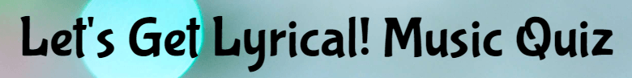

- Quiz instructions
    - Simple instructions telling the user what to expect from the quiz and how to submit their answers.
    - Separated into main quiz instructions and bonus question instructions.

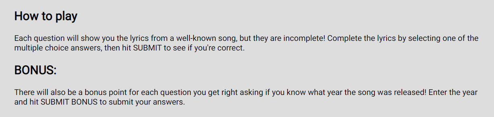

- Category selection
    - Allows the user to choose a category for which to answer questions.
    - Features text telling the user what the category is over a relevant image.
    - Event listener is used to select the corresponding questions array before running the quiz.
    - New categories can be added by adding a new image button to the HTML, and adding corresponding new question arrays and updating the category selection event listener in the JavaScript.

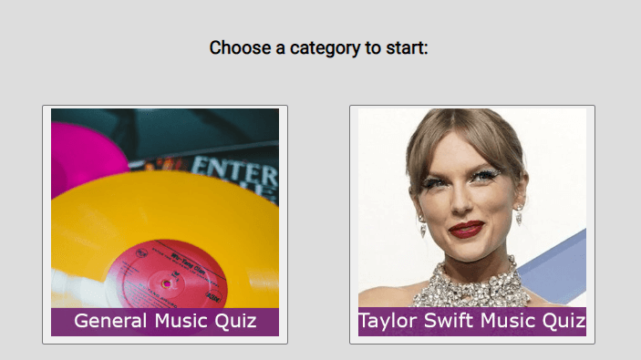

- Multiple choice questions
    - Asks user to fill in the blanks for song lyrics.
    - Questions will be shuffled at the start of the quiz, so they will appear in a random order each time (JavaScript function uses Fisher-Yates shuffle algorithm).
    - Code uses radio buttons so user can only select one but has the choice of changing their selection before submitting their answer.
    - Radio buttons are styled to look like normal buttons as it is aesthetically nicer.
    - Selected buttons will change colour so it is clear which one has been selected. Buttons also change colour when the user hovers over them.

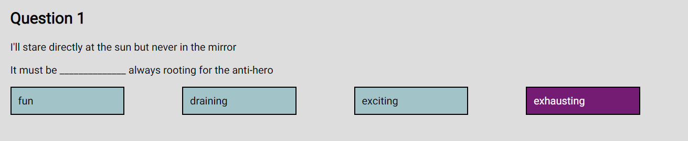

- Extra song information
    - Song title, artist and an image of the artist appear below each question to provide helpful information to the user.
    - The images are taken from the music video as often as possible to keep them relevant.

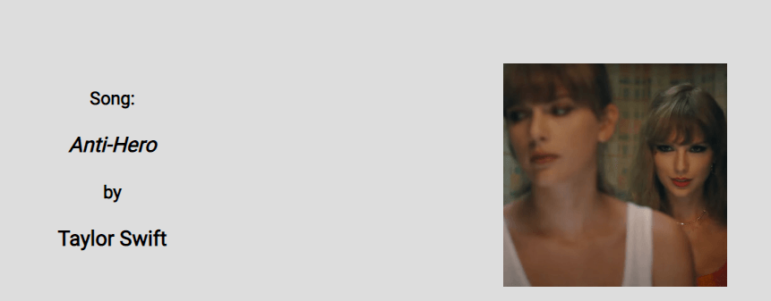

- Submit buttons
    - Text changes based on quiz stage - 'SUBMIT' to submit answers to the main questions, 'SUBMIT BONUS' to submit answers to the bonus questions, 'NEXT QUESTION' to move onto the next question after seeing answer feedback and 'FINISH QUIZ' after completing the final question.
    - Event listener moves the the next function based on the text inside the button.
    - Allows the user to move through the quiz at their own pace, e.g., if they want to change their mind about a multiple choice question answer before submitting or if they want to stop and listen to a song before moving on to the next question.
    - Button changes colour when user hovers over it (consistent with other buttons on the site).

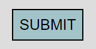
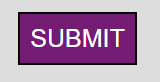

- Bonus questions
    - User will only see the bonus questions for main questions they answer correctly.
    - Asks user the year the single came out.
    - Features number input going from 1970 - 2022 (can be adjusted if new songs are added that came out before or after these years).
    - User will see an alert if they leave the input blank or try to enter a year outside the accepted range.

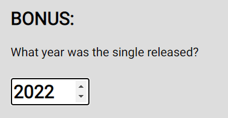

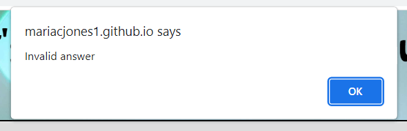

- Correct/incorrect answer pop-ups
    - User will see a pop-up after answering each question, telling them if they answered correctly or incorrectly.
    - Incorrect answer pop-ups will tell the user the correct answer.
    - Correct and incorrect pop-ups after the bonus question, and incorrect pop-ups after the main question, feature a link to watch the song's music video on YouTube which will open in a new tab. Correct answers after the main question do not have this as the user will see it after answering the bonus question.
    - Correct pop-ups have a green background and incorrect pop-ups have a light red background, as these colours are universally known to symbolise correct and incorrect answers.

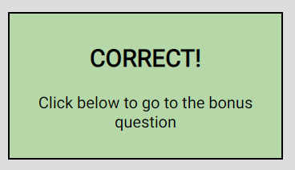

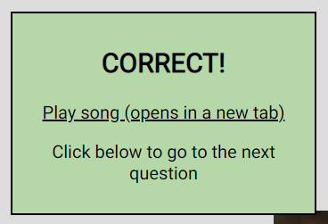

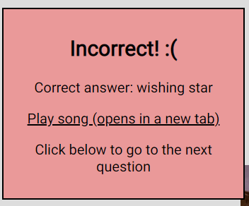

- Scores
    - User's current scores appear at the bottom of the screen.
    - Scores are calculated and updated in real-time.
    - Scores are broken down into Correct Answers (to the main questions), Bonus Points (for bonus questions answered correctly), and Total (the sum of Correct Answers and Bonus Points).

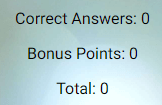

- High score
    - Users who have taken the quiz before will see their high score in the screen header.
    - High score will update if the user takes the quiz again and scores a higher total.
    - Users who have not taken the quiz before, or who have done so on a different device or using a different browser, will see a high score of 0.

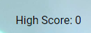

- Final scores
    - Upon completing the quiz, the user will see their final scores for correct answers, bonus points and total.
    - This is also when the high score in the header will update if the new total is higher than the previous high score.

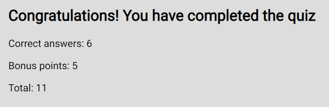

- Play again
    - Also upon completing the quiz, the user will have the opportunity to play again by seeing the same category selection buttons they saw on the first screen, this time accompanied by the text 'Play again?'.
    - This will cause the questions from the selected array to be shuffled again before showing the new Question 1, so even if the user chooses the same category, the questions will appear in a different order.

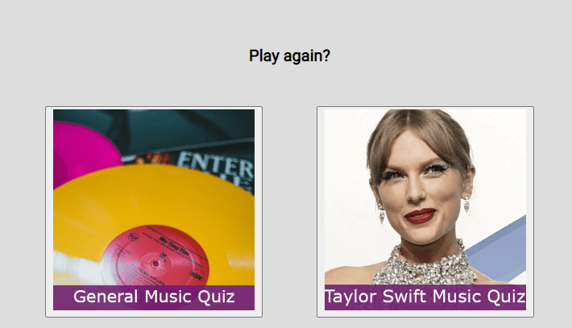

- Custom 404 error page
    - Appears if user tries to access a non-existent page on the site.
    - Features an image from a well-known song relevant to the text (Text: 'Oops! Image from 'Oops!..I Did It Again by Britney Spears) and a link back to the homepage.
    - Styling is consistent with the rest of the site so as not to be too jarring if it appears.

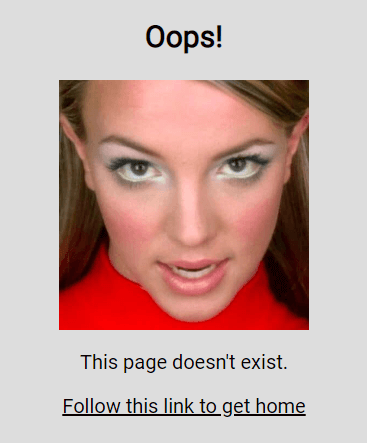

- Favicon
    - User experience is enhanced by featuring a favicon relevant to the site (music notes over a CD)

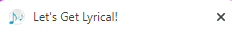

- Style choices
    - The background image was chosen to look nicer than a plain-coloured background, but it uses light colours and no harsh lines so it does not distract from the main quiz area.
    - The light grey background for the main quiz area was chosen as there is still enough contrast to be able to easily reaad the text over it, but it is less harsh on the eyes than a bright white.
    - Roboto was chosen as the main font as it looks nice and is easy to read. Bubblegum Sans was chosen for the logo font as it is visually different and more fun, without being distracting.
    - The blue and purple for the buttons were chosen to go with the background image and also to provide enough contrast to each other that it is obvious when a button is being hovered over or has been selected. The blue colour also matches the default background if the image fails to load.

## Wireframes
[Balsamiq](https://balsamiq.com/) was used to create initial wireframes for the project. All page views were initially designed for desktop screens, with one final wireframe designed to show how the layout will be adapted on mobile screens (all screens share the same basic layout). Main changesmade to the finals layouts are:
- The background uses an image of defocused coloured lights, which looks nicer than a plain background (the blue used in the wireframes is used as the fallback background colour if the image doesn't load).
- The high score has been brought in-line with the end of the 'main' section (all content within the grey box) instead of being in the corner of the screen.
- The radio buttons for the multiple choice questions were styled to look like regular buttons.

Click to view wireframes

### Instructions and category selection
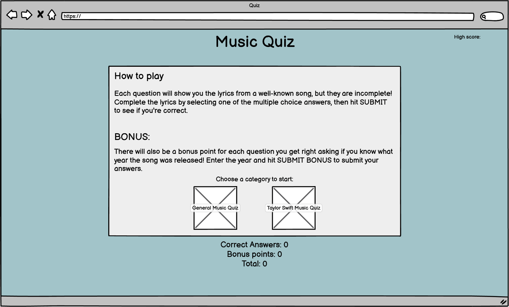

### Main question
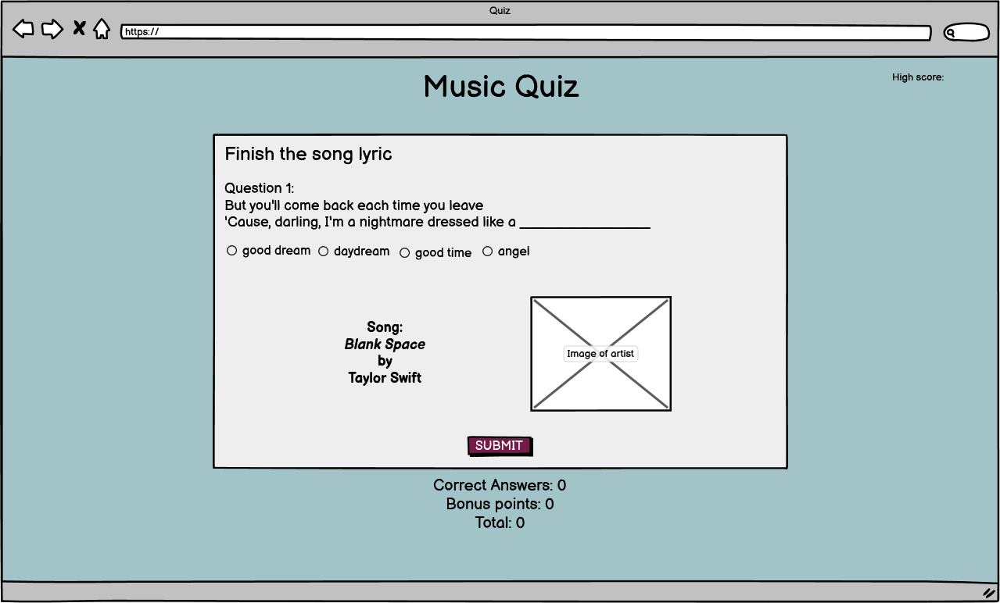

### Correct answer
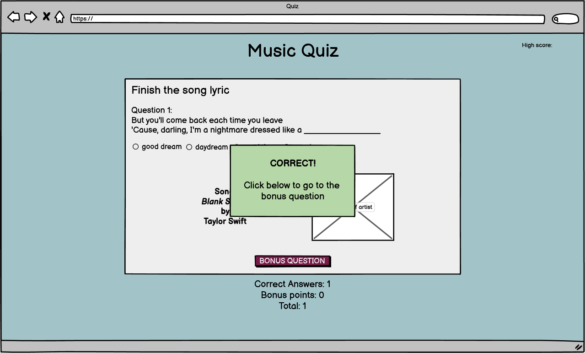

### Incorrect answer
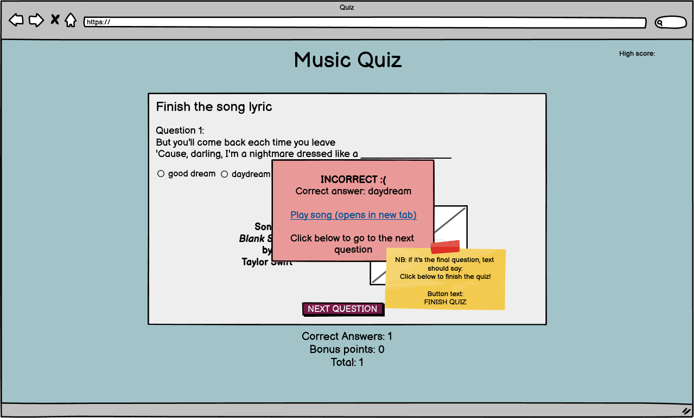

### Bonus question
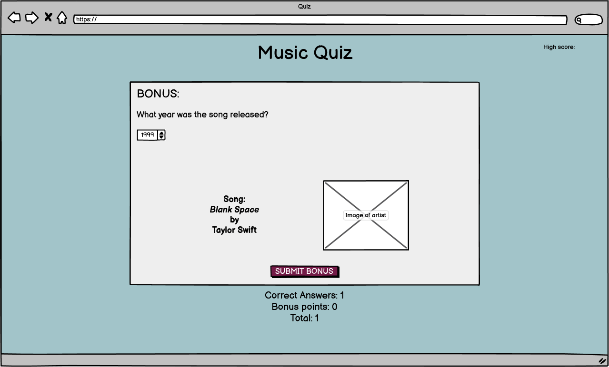

### Correct bonus answer
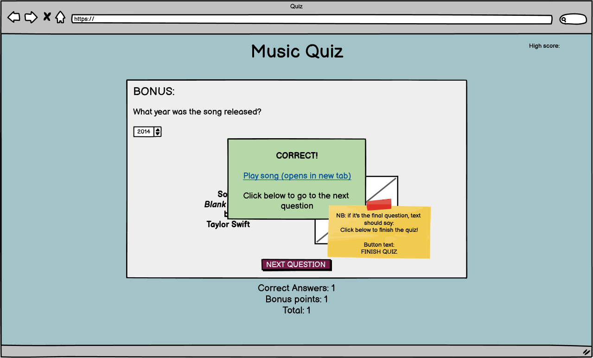

### Incorrect bonus answer
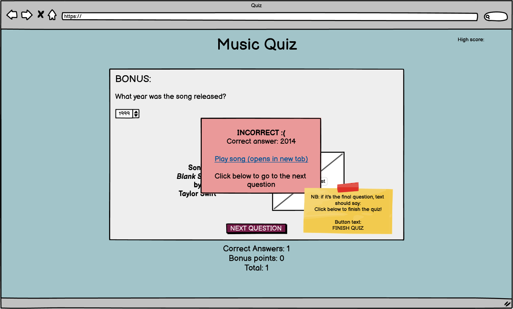

### Final page
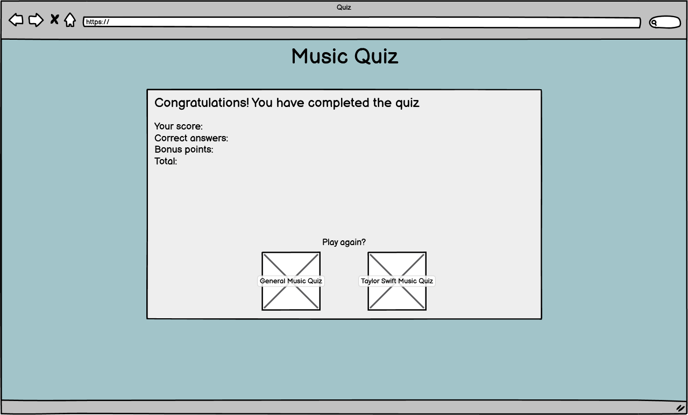

### Mobile layout
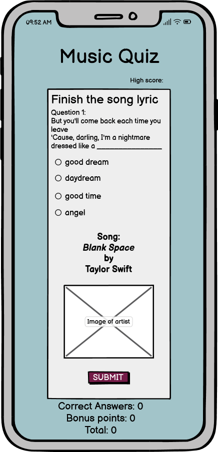

## Testing
### Bugs found and fixed during development and testing

| Bug | Fix |
| --- | --- |
| Background image does not cover screen, despite background-size property being set to 'cover'. | Set HTML height to 100%, however when tested on smaller devices the background still did not cover the bottom of the screen after scrolling down. Moved the HTML height property to a media query to apply only to screens with width 770px and above. This worked fine until tested on wider devices in landscape mode, so set media query to apply only when device orientation is portrait. Final solution. |
| Category selection buttons showed with rounded corners on mobile screen, despite no border radius property being set. This resulted in the corners of the images being cut off. When reappearing on the final page, only one button had this appearance, making them inconsitent. | Solved by setting the same padding to all sides of the category selection buttons. Also added a border so they are consistent with other buttons on the site. |
| Question content did not change when a new question was meant to be shown. | Solved by putting question template literal into a function, to be called each time a new question was needed. |
| No functions running on site preview. | Missing comma in question array flagged in Dev Tools. Issue solved by adding comma to JavaScript file. |
| Bonus answer was accepting empty strings and invalid answers despite min- and max-values being set and having 'required' attribute. | Put bonus question label and answer input inside form element, but this did not solve it as the submit button was not inside the form element. Instead, set conditions in the JavaScript event listener that will only accept the answer if the string is not empty and is greater or equal to than 1970 and less than or equal to 2022, otherwise an alert will show. |
| Number input for bonus question is much wider in Firefox browser than other browsers. | Set input width in CSS so it is consistent across browsers. |
| Images and category selection buttons spill over the edges of the main section border on Dev Tools Galaxy Fold (width 280px). | Use media query to reduce image set height, width and padding and category selection button padding for smallest screen sizes (350px and below). |
| Answer pop-up is not visible on the screen after user submits answer on any smaller device where they have had to scroll down to the submit button. User must scroll back up to see it but will not necessarily know to do that before tapping the 'next question' button. | Solved by setting the answer pop-up position to fixed, so it will always be visible as soon as it appears, regardless of the user's position on the page. |

### Browser tests (final)

| Browser | No layout issues | All features work |
| --- | --- | --- |
| Chrome | x | x |
| Firefox | x | x |
| Edge | x | x |
| Safari* | x | x |
N.B. Safari tested on mobile device only.

### Device/screen size tests (final)
(Tested using Dev Tools, portrait and landscape where applicable)

| Device | No layout issues |
| --- | --- |
| Dell desktop screen (model unknown, size 1920x1200) | x |
| HP laptop screen (model unknown, size 1536 x 864) | x |
| iPhone SE | x |
| Pixel 5 | x |
| Samsung Galaxy S20 Ultra | x |
| iPad Air | x |
| Surface Pro 7 | x |
| Nest Hub | x |

### Validator tests

| File tested | Validator used | Validator feedback | Actions taken |
| --- | --- | --- | --- |
| index.html | [W3C validator](https://validator.w3.org/) | **No errors.** **Warning:** Section lacks heading. Consider using h2-h6 elements to add identifying headings to all sections, or else use a div element instead for any cases where no heading is needed. **Three instances:** From line 55, column 9; to line 55, column 28 From line 60, column 9; to line 60, column 41 From line 67, column 9; to line 67, column 36 | Line 55 and line 67 are blank sections - no action taken. Paragraph element 'Choose a category to start:' changed to H3 element in section starting on line 60. |
| style.css | [(Jigsaw) validator](https://jigsaw.w3.org/css-validator/) | **No errors.** **Warning:** Imported style sheets are not checked in direct input and file upload modes | N/A |
| script.js | [JSHint](https://jshint.com/) | **No errors.** **75 warnings** consisting of: Missing semicolon. 'const' is available in ES6 (use 'esversion: 6') or Mozilla JS extensions (use moz). 'template literal syntax' is only available in ES6 (use 'esversion: 6'). 'let' is available in ES6 (use 'esversion: 6') or Mozilla JS extensions (use moz). 'for of' is available in ES6 (use 'esversion: 6') or Mozilla JS extensions (use moz). Functions declared within loops referencing an outer scoped variable may lead to confusing semantics. (quizQuestions, shuffleQuestions, runQuiz) 'destructuring assignment' is available in ES6 (use 'esversion: 6') or Mozilla JS extensions (use moz). Functions declared within loops referencing an outer scoped variable may lead to confusing semantics. (quizQuestions, shuffleQuestions, currentQuestion, resetScore, runQuiz) **One unused variable:** highScore | Missing semicolons added throughout file and unused variable deleted. No other actions taken. |
| 404.html | [W3C validator](https://validator.w3.org/) | **No errors or warnings.** | N/A |

### Dev Tools Lighthouse tests

| Category | Score |
| --- | --- |
| Performance | 97 |
| Accessability | 100 |
| Best Practices | 92 |
| SEO | 100 |

**Console error:** Manifest: Line: 1, column: 1, Syntax error. site.webmanifest:1 
**Solved:** Add < crossorigin="use-credentials" > to manifest link (solution found on [Denis Bouquet](https://www.denisbouquet.com/solve-manifest-line-1-column-1-syntax-error-site-webmanifest1-401-error/))

## Deployment
This site was deployed through GitHub pages using the following steps:
1. Open the GitHub repository and go to Settings
2. Go to Pages in the column on the left-hand side
3. Select Source: Deploy from a branch. From the drop-down menu underneath Branch, select main and save
4. Refresh the page after a few minutes and you will see that the site is live, with a link for you to access it

The live link can be found here: [https://mariacjones1.github.io/music-quiz/](https://mariacjones1.github.io/music-quiz/)

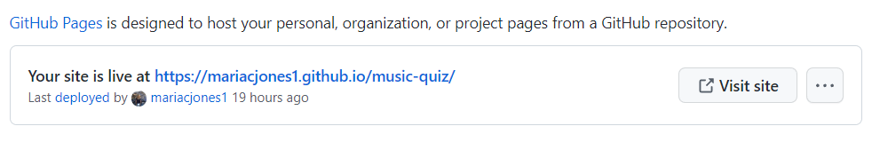

### Forking
Future contributors can work on the project by forking the repository. Detailed instructions for how to do so in GitHub can be found [here](https://docs.github.com/en/get-started/quickstart/contributing-to-projects), including instructions to make pull requests to have the changes merged with the original repository.

## Credits
### Content
- Song information, release dates and lyrics found on Google.

Screenshot

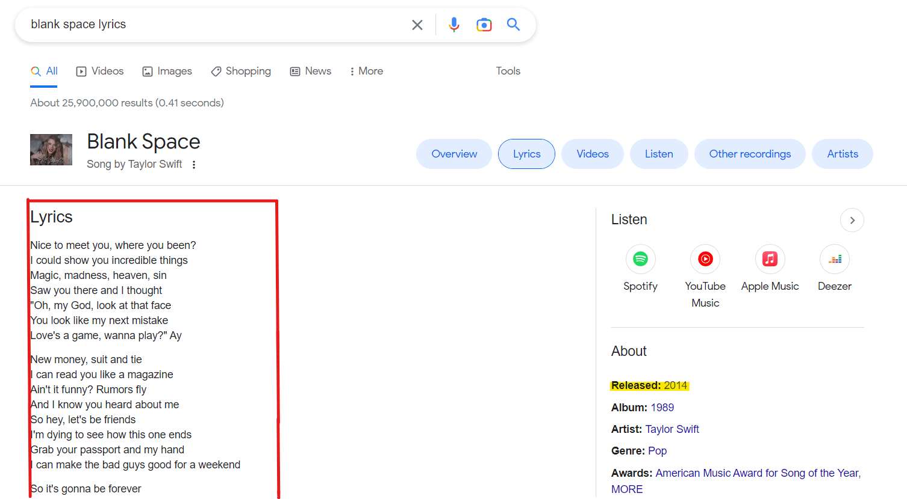

### Media
- Images of artists found on Google Images.
- Background found on [Pexels](https://www.pexels.com/photo/defocused-image-of-lights-255379/).
- Favicon image found on [Pixabay](https://pixabay.com/users/clker-free-vector-images-3736/?utm_source=link-attribution&amp;utm_medium=referral&amp;utm_campaign=image&amp;utm_content=41071">Clker-Free-Vector-Images) and converted using [favicon.io](https://favicon.io/).
- Font found on [Google Fonts](https://fonts.google.com/).

### Additional coding resources
- How to style radio buttons: [Sound Code](https://markheath.net/post/customize-radio-button-css)
- Fisher-Yates shuffle algorithm: [DEV community](https://dev.to/codebubb/how-to-shuffle-an-array-in-javascript-2ikj)
- General help:
    - [w3 schools](https://www.w3schools.com/)
        - [Local Storage](https://www.w3schools.com/html/html5_webstorage.asp)
    - [MDN](https://developer.mozilla.org/en-US/)
    - [stack overflow](https://stackoverflow.com/)

### Mentor
Can Sucullu provided advice, suggestions and additional resources throughout the project.