# Let's Get Lyrical! Music Quiz
Let's Get Lyrical! Music Quiz is a quiz website where users fill in the blanks for lyrics of well-known songs by answering mulptiple choice questions and, if they get the question right, they can get an extra point by answering the bonus question asking what year the single came out.

Final website: [https://mariacjones1.github.io/music-quiz/](https://mariacjones1.github.io/music-quiz/)

## User goals
- To test knowledge of song lyrics by answering quiz questions.
- To be able to do the quiz on any device (desktop, tablet, mobile).
- To be able to see their previous high score.
- To be able to repeat the quiz as many times as desired without having to refresh the page to go back to the start.
- To be able to read the instructions before completing the quiz.
- To see questions in a random order.
- To have the opportunity to score bonus points for each question answered correctly.
- To receive immediate feedback for each question answer.
- To be able to play the relevant song after answering each question.

## Owner goals
- To provide a fun way for users to test their music knowledge.
- To make a music quiz website which can be built upon over time, with new quiz questions and categories.

## Features
- Responsive layouts
    - Desktop-, tablet- and mobile-friendly designs (see mock-up above).
- Site logo
    - Uses a different font to the rest of the site so that it stands out, but overall design is kept simple so it's not distracting.
    - Clicking on it will navigate back to the start/refresh the page.
    - Not fixed to prevent it from taking up too much space when user scrolls down on smaller screens.

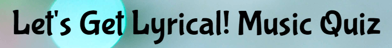

- Quiz instructions
    - Simple instructions telling the user what to expect from the quiz and how to submit their answers.
    - Separated into main quiz instructions and bonus question instructions.

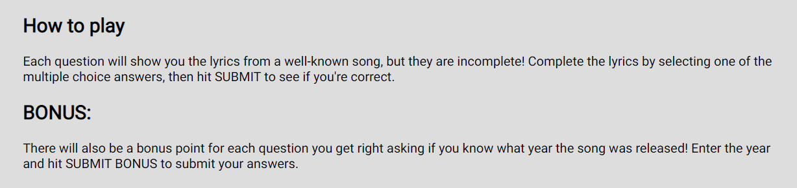

- Category selection
    - Allows the user to choose a category for which to answer questions.
    - Features text telling the user what the category is over a relevant image.
    - Event listener is used to select the corresponding questions array before running the quiz.
    - New categories can be added by adding a new image button to the HTML, and adding corresponding new question arrays and updating the category selection event listener in the JavaScript.

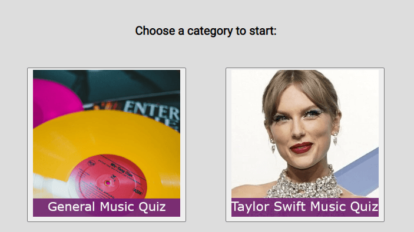

- Multiple choice questions
    - Asks user to fill in the blanks for song lyrics.
    - Questions will be shuffled at the start of the quiz, so they will appear in a random order each time (JavaScript function uses Fisher-Yates shuffle algorithm).
    - Code uses radio buttons so user can only select one but has the choice of changing their selection before submitting their answer.
    - Radio buttons are styled to look like normal buttons as it is aesthetically nicer.
    - Selected buttons will change colour so it is clear which one has been selected. Buttons also change colour when the user hovers over them.

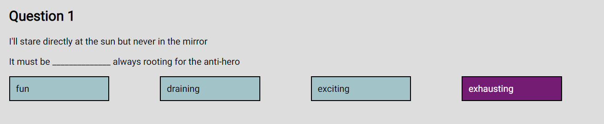

- Extra song information
    - Song title, artist and an image of the artist appear below each question to provide helpful information to the user.
    - The images are taken from the music video as often as possible to keep them relevant.

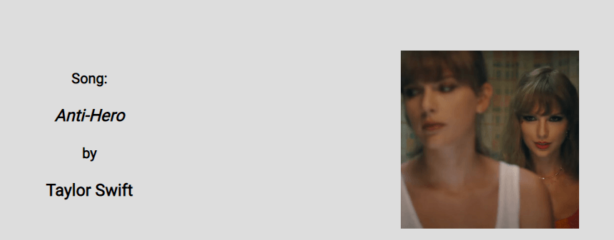

- Submit buttons
    - Text changes based on quiz stage - 'SUBMIT' to submit answers to the main questions, 'SUBMIT BONUS' to submit answers to the bonus questions, 'NEXT QUESTION' to move onto the next question after seeing answer feedback and 'FINISH QUIZ' after completing the final question.
    - Event listener moves the the next function based on the text inside the button.
    - Allows the user to move through the quiz at their own pace, e.g., if they want to change their mind about a multiple choice question answer before submitting or if they want to stop and listen to a song before moving on to the next question.
    - Button changes colour when user hovers over it (consistent with other buttons on the site).

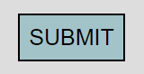
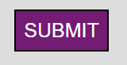

- Bonus questions
    - User will only see the bonus questions for main questions they answer correctly.
    - Asks user the year the single came out.
    - Features number input going from 1970 - 2022 (can be adjusted if new songs are added that came out before or after these years).
    - User will see an alert if they leave the input blank or try to enter a year outside the accepted range.

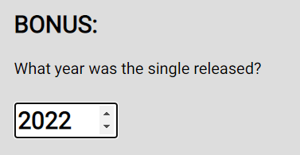

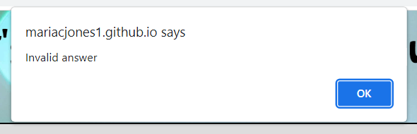

- Correct/incorrect answer pop-ups
    - User will see a pop-up after answering each question, telling them if they answered correctly or incorrectly.
    - Incorrect answer pop-ups will tell the user the correct answer.
    - Correct and incorrect pop-ups after the bonus question, and incorrect pop-ups after the main question, feature a link to watch the song's music video on YouTube which will open in a new tab. Correct answers after the main question do not have this as the user will see it after answering the bonus question.
    - Correct pop-ups have a green background and incorrect pop-ups have a light red background, as these colours are universally known to symbolise correct and incorrect answers.

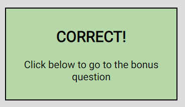

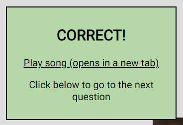

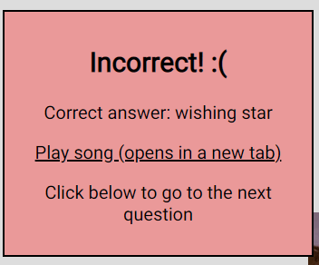

- Scores
    - User's current scores appear at the bottom of the screen.
    - Scores are calculated and updated in real-time.
    - Scores are broken down into Correct Answers (to the main questions), Bonus Points (for bonus questions answered correctly), and Total (the sum of Correct Answers and Bonus Points).

- High score
    - Users who have taken the quiz before will see their high score in the screen header.
    - High score will update if the user takes the quiz again and scores a higher total.
    - Users who have not taken the quiz before, or who have done so on a different device or using a different browser, will see a high score of 0.

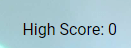

- Final scores
    - Upon completing the quiz, the user will see their final scores for correct answers, bonus points and total.
    - This is also when the high score in the header will update if the new total is higher than the previous high score.

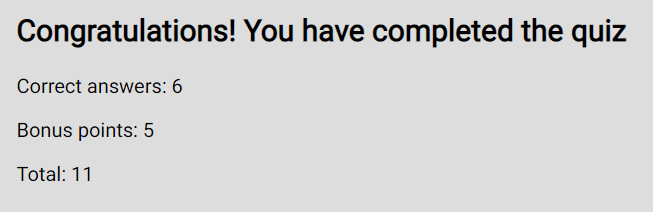

- Play again
    - Also upon completing the quiz, the user will have the opportunity to play again by seeing the same category selection buttons they saw on the first screen, this time accompanied by the text 'Play again?'.
    - This will cause the questions from the selected array to be shuffled again before showing the new Question 1, so even if the user chooses the same category, the questions will appear in a different order.

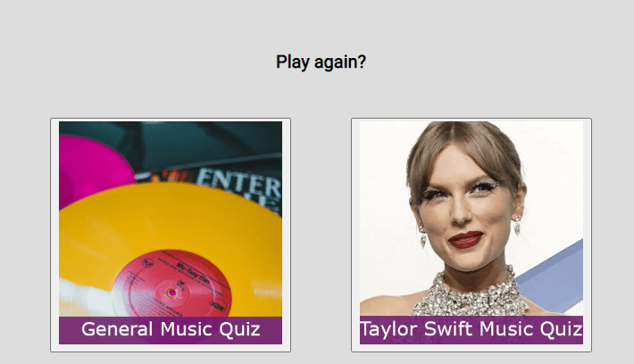